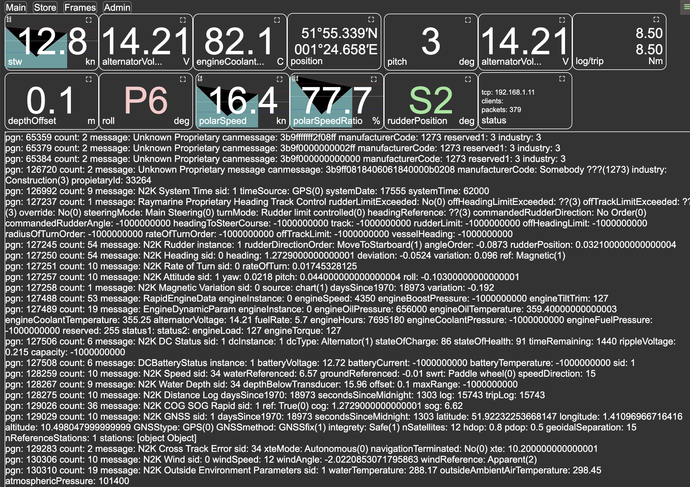
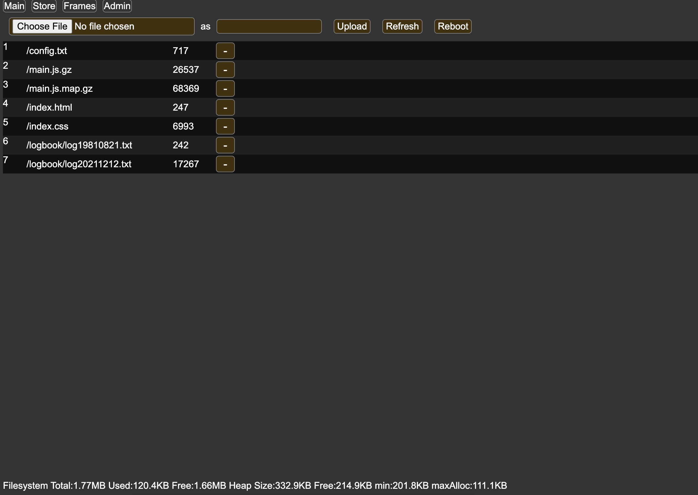
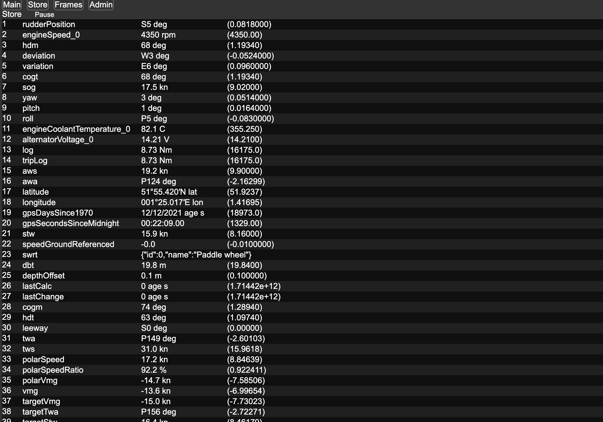
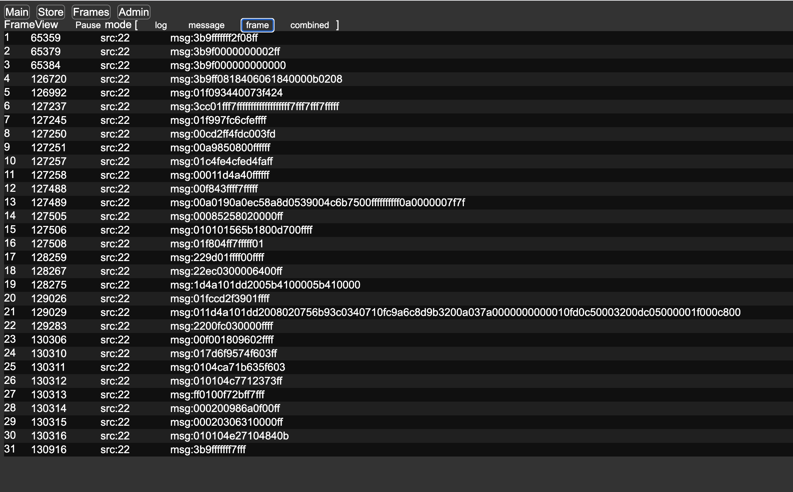
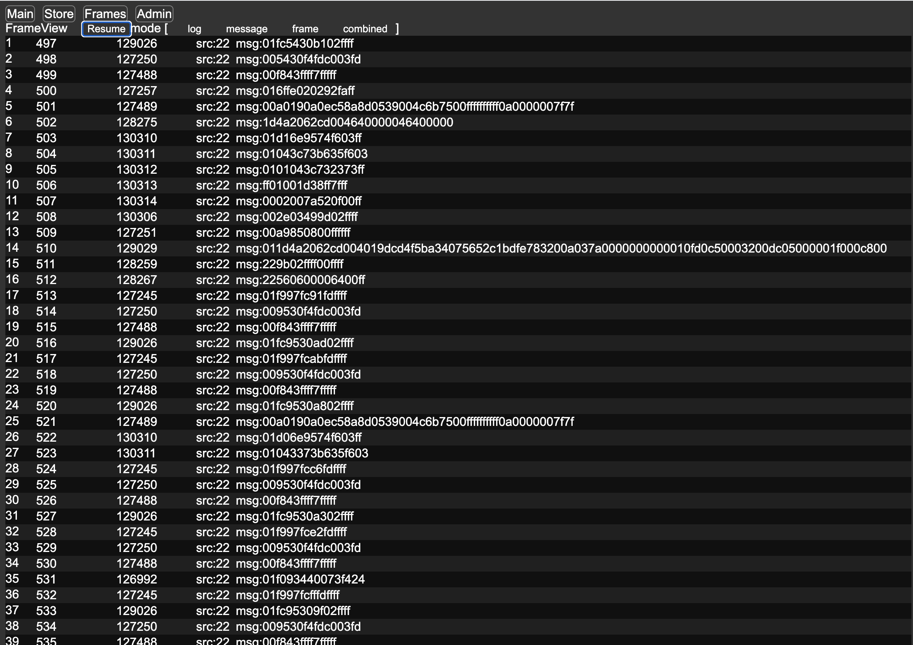
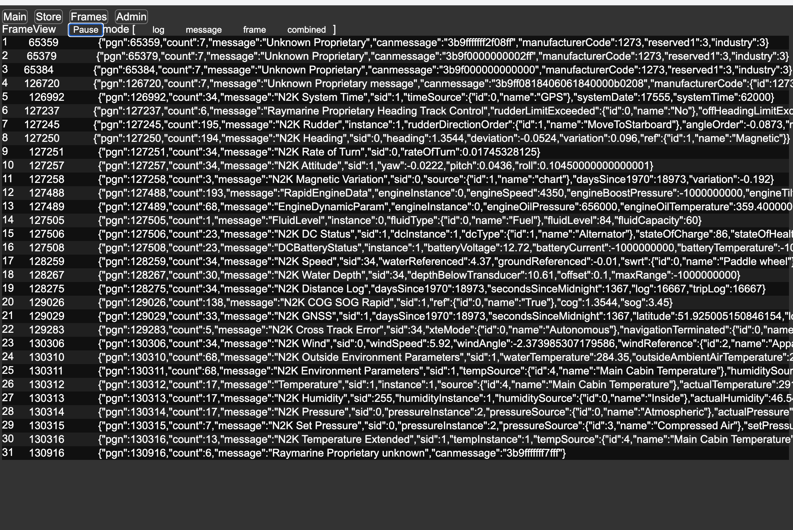

# N2K and NMEA0183 Wifi server exposing http, tcp and udp services.

* Runs on a ESP32. 
* Connects to a NMEA2000 bus using the ESP CAN device and a CAN Driver as a CAN Node. 
* Parses NMEA2000 messages and stores them with history. 
* Emits NMEA0183 messages on tcp and udp.
* Exposes a http admin interface for configuration.
* Exposes the store over http.
* Exposes updates to the store over websockets.
* Hosts UI applications delivered over http.
* Runs either as an WiFi station or as an Access Point.

# UI

There is a web browser UI written as a single page application, delivered from the http server running on the 
ESP. It receives CAN messages over websockets which it decodes and displays. The main screen is an 
instruments screen which can contain 1..n mages and can be configured. Other screens include a store viewer 
showing the data that has been received, and frame views showing decoding.  There is an admin view which 
provides access to the flash drive to update the UI files, download log files and monitor disk and ram usage 
on the device.  There is 2MB of flash available. The App is 26KB of javascript compressed which can be 
updated from build or via the admin ui over http.

ToDo

* [x] Setup Wifi
* [x] Setup MDNS registration
* [x] Implement webserver
* [x] Serve files from Flash (SPIFFS)
* [x] Implement data api /api/data/<n> where n == 0-10.
* [x] Expose set of standard CAN messages on /api/data
* [x] Implement simple UI in Javascript hosted on SPIFFS, targetting eink and normal browsers (based on SignalK eink)
* [x] Implement admin interface.
* [x] Support configuration and calibration via web browser.
* [x] Implement TCP server 
* [x] Implement NMEA0183 bridge
* [x] Reduce Wifi power to 2dbm, also helps avoid can brownouts and hangs.
* [x] Test NMEA0183 with NKE, Navionics and NMea android apps.
* [x] Implement UDP server 
* [x] Implement WebSocket Server
* [-] ~~Wire Store into NMEA0183 outputs~~
* [x] Expose message stream over websockets
* [x] Emit NMEA0183 messages generated from calculations
* [x] Verify performance messages
* [x] Remove N2KCollector
* [x] Emit data for websockets in raw form tbd.
* [x] Emit raw pgn messages in some form.
* [x] Port in web apps from Electron NMEA App in ui/v2
* [x] Fix messages display in v2 ui
* [x] Apply eslint
* [x] Convert to installable PWA
* [-] ~~Support ESP32 on https for PWA~~  Too much effort, AsyncTCP support not there. Workaround: allow insecure content on localhost and load service worker from localhost.
* [x] Implement service worker cache
* [x] Implement Admin Login without relying on Browser, as BasicAuth popups in ServciceWorkers dont work offlin. On fixing found out: Explicitly setting headers works, but service workers use preflight on GET urls and are stricter about the cors headers than a direct fetch from a window context.  Username and password are now stored in sessionStorage and logout works.
* [x] Urls not easy to use to nav (Workaround, open in browser, change url, open in app)
* [x] Add ability to set the server url for data
* [x] Add day night themes.
* [x] Fix menu system.
* [x] Add can debug view to v2 ui.
* [x] Replace layout editing and storage on esp32 with localstorage
* [x] Add PWA for LifePo4 battery management, standalone PWA over BLE. 
* [x] Support upload and download of layouts for local editing.
* [x] Verify target VMG down wind.
* [x] Support debugging store behavior in debug view to verify polar and calculations.
* [x] Load default layouts over http.
* [ ] Persist history in local storage
* [ ] Port eink displays

## HTTP APIs

### GET /api/fs.json - admin only

lists the filesystem as json

### POST /api/fs.json - admin only

Filesystem operations.

* op=delete deletes the file defined by path
* op=upload multipart, uploads the first file to the location defined by the path param, limited by filesystemspace.

### GET /api/store

Gets the store from the ESP32 in csv format, see code for details on the values.

### GET /api/devices 

Gets a text version of the devices on the bus

### GET /api/status.json - admin only

Gets the status of filesystem and heap

### POST /api/reboot.json - admin only

Reboots the ESP32.

### GET /config.txt - admin only

Gets the congiuration file

### GET /**

gets the file from the filesystem, query params are ignored.

## TCP/UDP

Runs on 10110 and emits NMEA0183 sentences, see lib/NMEA0183N2KMessages.h for a list of messages.

## WebSocket

Only /ws/candump3, /ws/seasmart and /ws/183 have been implemented. Other formats have been tried but these make the most sense for applications.

NMEA0183 output makes sense for standard messages, but it cant cover N2K. There are some options for how N2K could be output. All of the formats below can be processed by readers in canboatJS.

Websocket on a ESP32 has limited space for pending messages so all of these websocket endpoints work with that. Where the traffic is high the frames are debounced and buffered into larger websocket messages to reduce the impact of the websocket protocol. If this is not done, the ESP32 runs out of send buffer pointers and drops messages. Receivers need to split each message by \n 

### Candump version 3 modified, /ws/candump3m  - not implemented yet

    89f10d16#01f997fc3cfeffff\n
             ^^^^^^^^^^^^^^^^ data
    ^^^^^^^^ can id

Bare minimim, should be easy to covert into candump3 on the client, needs access to the raw stream before fastpackets are handled, or needs to reconstruct fast packets where the length is > 8.

### Candump version 3, /ws/candump3 - implemented

    (1713293415.384000) slcan0 89f10d16#01f997fc3cfeffff
                                        ^^^^^^^^^^^^^^^^ frame
                               ^^^^^^^^ can id
                        ^^^^^^ device
    ^^^^^^^^^^^^^^^^^^^ time in seconds

Very low cost to output, but high volume and the frame has to be processed for fast packets in the client. 

### Yacht Devces Raw /ws/raw - no plans to implement

    19F51323 01 02<CR><LF>
             ^^^^^ frame data hex space separated 
    ^^^^^^^^ canID

    17:33:21.107 R 19F51323 01 2F 30 70 00 2F 30 70
    may also be prefixed by a timestamp and direction

Very low cost to output, but high volume and the frame has to be processed for fast packets in the client. 
Senders need to slice up the data, PGN 126720 (proprietary fast packet) gets special treatment why tbd.

This is close or the same as the log files produced by Raymarine e7 MFDs and other devices.

### NMEA183 PCDIN aka Seasmart /ws/seasmart - implemented

http://www.seasmart.net/pdf/SeaSmart_HTTP_Protocol_RevG_043012.pdf

    $PCDIN,01F119,00000000,0F,2AAF00D1067414FF*59
                                               ^^ checksum
                              ^^^^^^^^^^^^^^^^ data (whole message)
                           ^^ source
                  ^^^^^^^^ Hex time
           ^^^^^^ PGN
    ^^^^^^ NMEA0183 id

Decoding hex time is done as 

    ((parseInt(value,32)/1024)+1262304000)*1000 

result in ms since 1/1/1970.  No idea what base 32 looks like, but tests don't make sense.
Should probably avoid, however it does have the advantage of being able to mix with NMEA0183 traffic provided
the bandwidth is enough.  Looks like it was designed to send over http.

There is also a command protocol, PCDIC

It is inlikely that I want to use applications supporting this protocol, but it is used by a few. Disadvantages, messages can be huge and have to be constructed to send over websockets and its (c) Seasmart.

Seasmart compact, can be expanded by the client into seasmart by adding the missing fields.

    01F119,0F,2AAF00D1067414FF
              ^^^^^^^^^^^^^^^^ base64 data
          ^^ source
    ^^^^^^ PGN

### NMEA183 MXPGN  /ws/nmea0183 - not implemented

https://opencpn.org/wiki/dokuwiki/lib/exe/fetch.php?media=opencpn:software:mxpgn_sentence.pdf

    $MXPGN,01F801,2801,C1308AC40C5DE343*19
                                        ^^ checksum
                       ^^^^^^^^^^^^^^^^ data (frame only, since lenght limited to 8 max)
                    ^^ src
                  ^^ data length + priority encoded 
           ^^^^^^ PGN
    ^^^^^^ NMEA0183 id

    data length bits 28 -> hex, padded to 8 eg  
    0b00101000
          ^^^^ DLC  1-8 length or 9-15 class 2 transmission ID, length always 8 in this case.
       ^^^ priority eg 2
      ^ send/rec eg rec

### NMEA184 iKonvert /ws/nmea0183 - not supported

    !PDGY,126992,3,2,255,0.563,d2009e45b3b8821d*23
                                                ^^ checksum
                               ^^^^^^^^^^^^^^^^ data base64 encoded.
                         ^^^^^ timer seems it might be optional.
                     ^^^ dest
                   ^ source
                 ^ priority
          ^^^^^^ PGN decimal
    ^^^^^ NMEA183 id, ! probably means binary

### candump1  /ws/candump1  - not implemented

    <0x18eeff01> [8] 05 a0 be 1c 00 a0 a0 c0
                     ^^^^^^^^^^^^^^^^^^^^^^^ frame
                 ^^^ len 
    ^^^^^^^^^^^^ canID

### candump2 /ws/candump3  - not implemented

    can0  09F8027F   [8]  00 FC FF FF 00 00 FF FF
                          ^^^^^^^^^^^^^^^^^^^^^^^ frame
                      ^ len
          ^^^^^^^^ canid
    ^^^^ device

### Actisense /ws/actisense  - not implemented

    2016-02-28T19:57:02.364Z,2,127250,7,255,8,ff,10,3b,ff,7f,ce,f5,fc
                                              ^^^^^^^^^^^^^^^^^^^^^^^ data
                                            ^ length
                                        ^^^ destination
                                      ^ source
                               ^^^^^^ pgn
                             ^ priority
    ^^^^^^^^^^^^^^^^^^^^^^^^ ISO date

Easy to read, a bit of a standard, but also verbose.
For date we would need to capture the date from GPS.

### Actisense N2K ASCII - not supported

    A764027.880 05FF7 1EF00 E59861060202FFFFFFFF03030000FFFFFFFFFFFFFFFFFFFF0000FFFFFF7FFFFFFF7FFFFFFF7F0000FF7F
                      ^^^^^^^^^^^ full can message, upto 400 chars
                    ^ priority
                  ^^ dest
                ^^ src
     ^^^^^^^^^^ timestamp

Full messages are problematic with memory.

### Data Link encoded  - not implemented

Binary format see apenedix F in https://www.yachtd.com/downloads/ydnu02.pdf

Below is a copy

        APPENDIX F. Format of Messages in N2K Mode
        In N2K mode, messages are encoded in a binary format. This format is based on Data Link Escape encoding
        partially compatible with ActiSense NGT format and widely support by modern marine applications.
        This format is very similar to Garmin Serial Protocol (see section 3.1 of Garmin Device Interface
        Specification 001-00063-00 for details).
        All data are transferred in byte-oriented packets. A packet contains a four-byte header (DLE, STX, ID,
        and Size), followed by a variable number of data bytes, followed by a three-byte trailer (Checksum, DLE,
        and ETX). The following table shows the format of a packet:
        
        Table 1. Packet format
        
        Byte Number Byte Description Note
        ---------------------------------
        0           Data Link Escape ASCII DLE character (16 decimal)
        1           Start of Text ASCII STX character (02 decimal)
        2           Packet ID Identifies the type of packet
        3           Size of Packet Data Number of bytes of packet data (bytes 4 to n-4)
        4 to n—4    Packet Data 0 to 255 bytes, see Table 2
        n—3         Checksum 2's complement of the sum of all bytes from byte 1 to byte n-4
        n—2         Data Link Escape ASCII DLE character (16 decimal)
        n—1         End of Text ASCII ETX character (03 decimal)
        
        If any byte in the Size, Packet Data, or Checksum fields is equal to DLE, then a second DLE is inserted
        immediately following the byte. This extra DLE is not included in the size or checksum calculation.
        This procedure allows the DLE character to be used to delimit the boundaries of a packet.
        Packets with NMEA 2000 messages transmitted to the PC application (incoming) have ID 0x93
        (147 decimal), packets with NMEA 2000 messages sent by the application to the Device (outgoing)
        have ID 0x94 (148 decimal).
       
        Byte Number Byte Description Note
        ----------------------------------
        0           Message Priority Bits 0 - 2 are significant, other bits are ignored
        1 to 3      NMEA 2000 PGN Least significant byte is first
        4           Destination Address Or 255 decimal for global addressed messages
        5           Source Address Ignored for outgoing messages, Device address is used
        6—9         Time Stamp Device’s time in milliseconds, ignored in outgoing messages
        10          Size of Payload Number of bytes in NMEA 2000 message payload (1..232)
        11+         Message Payload 1 to 232 bytes of message payload
        
        The format of NMEA 2000 messages is available in Appendix B of NMEA 2000 Standard, which
        can be purchased on the site www.nmea.org.

Probably too much of a pain to implement.

### /ws/183  - implemented

Emits NMEA0183 same as on UDP and TCP.

### /ws/2kraw - deprecated

Emits Raw PGR messages containing pdg,destination,length,<hex encoded data>

Accpets the following messages

* addpgn:<pgn to be emitted>
* rmpgn:<pgn to be removed from filter>
* allpgn: 1 == emit all pgns, 0 filter pgns.

### /ws/2kparsed - deprecated

Emits PGN messages containg parsed fields.

Same commands.

## Archived functionality

The project was forked from CanDiagnose https://github.com/ieb/CanDiagnose wip branch which contains the functionality below.

* [x] Implement BPM280 source  (moved to archive)
* [x] Implement calibration mechanism using DAC (moved to archive)
* [Fail] Implement ADC Source (esp adc not sufficiently accurate)
* [x] Redesign PCB to use 16bit ADC over i2c  (ADS1115)
* [x] Implement ADC sensor code (move to archive)
* [x] Add OLED display  (moved to archive)
* [x] Add touch sensor to control oled display (moved to archive)
* [x] Bench Calibrate expecialy shunt (moved to archive)
* [x] Install test and calibrate. - Failed, the distance between the board and the batteries is too great to get reliable shunt measurements. 
* [x] Investigate using a shunt amplifier as used by VRA Alternator controller
* [x] Implement remote battery sensor using Modbus  (see BatterySensor project) (moved to archive)
* [x] Reimplement PCB to have no BME280 and no ADS1115 replacing with a RS485 interface to ModBus devices.  (see CanPressure for Can based pressure, humidity, temperature sensor) (moved to archive)
* [x] Implement Modbus master (moved to archive)
* [x] Support Configuraiton of single and differential ADC.

# Usage

The device will boot and connect to wifi controlled by its burned in config file (data/config.txt). 
There are 2 modes it can run in, a WiFi client or a AP. If its configured to be an AP, then join its network. If its a client find its ip. From now on this will be <ip>

Go to its ip on http://<ip> and you will see a data view of the data it is capturing.
Go to http://<ip>/admin.html and you will see a admin view with the ability to upload a new configuration file and reboot.

Both these views are SPAs served from static files burned into the ESP32 Flash using APIs.

Connecting to the serial port monitor allows lower level control and diagnostics, enter 'h<CR>' to get help.

# Developing

Project uses PlatformIO.  WebUI is in  ui/v2. This can be developed locally using node http-server in ui/vi/src or by updating the flash drive of a device running the firmare over http, using ui/v2/build.sh

## PIO commands

because I alwaysforget.

* pio run -t upload
* pio device monitor

See buildui.sh for SPIFFS image commands. Dont use this to update the flashdrive, its easier to use the admin ui or curl.

# Connectors

    ---------------------------------------------
    |           a b c d e f g h                 |
    |  A                                        |
    |  B                                        |
    |  C                                        |
    |  D                                     H  |
    |  E                                     I  |
    |  F                                     J  |
    |  G           i j k l m                 K  |
    ---------------------------------------------

    a  SPI BL   GPIO13  not in use
    b  SPI RST  GPIO12  not in use
    c  SPI DC   GPIO26  not in use
    d  SPI CS   GPIO25  not in use
    e  SPI SCK  GPIO33  not in use
    f  SPI MOSI GPIO32  not in use
    g  SPI GND          not in use
    h  SPI 3V           not in use
    i  i2c GND      Display black/blue not in use
    j  i2c SCL  D5    Display green not in use
    k  i2c SDA  D18    Display white not in use
    l  i2c BTN  D19    Display yellow not in use
    m  i2c 3V       Display red not in use

    A  1wire 1w  D21  not in use
    B  1wire GND  not in use
    C  1wire 3V not in use
    D  RS-485 5.8V not in use
    E  RS-485 GND not in use
    F  RS-485 A  not in use
    G  RS-485 B not in use
    H  CAN 12V
    I  CAN 0V
    J  CAN CANH
    K  CAN CANL

    Other Pins Not mentioned above
    RS485-TX TX2/GPIO17
    RS485-RX RX2/GPIO16
    RS485-EN D4
    CAN-RX  D22
    CAN-TX  D23

# Archived Functionality

Rather than using dedicated hardware displays I have decided to switch to apps since the power consumption is better and they require no installation onboard.  Most of the display code is in the archive subfolder.

## eInk Waveshare display  (archived)

This uses SPI output only with a bunch of additional pins.

    eInk DIN <-  f  SPI MOSI GPIO32
    eInk CLK <-  e  SPI SCK  GPIO33
    eInk CS  <-  d  SPI CS   GPIO25
    eInk DC  <-  c  SPI DC   GPIO26
    eInk RST <-  b  SPI RST  GPIO12
    eInk BUSY -> a  SPI BL   GPIO13

 

## 4 inch TFT display 480x320 24 bit colour driven by a ILI9488 driver. (archived)

uses SPI + a PWM blacklight. Control via a TPP233 Touch switch. Library is TFT_eSPI library. Pin mappings defined as compile definitions.

    -D TFT_MISO=GPIO_NUM_35
    -D TFT_MOSI=GPIO_NUM_32
    -D TFT_SCLK=GPIO_NUM_33
    -D TFT_CS=GPIO_NUM_25
    -D TFT_DC=GPIO_NUM_26
    -D TFT_RST=GPIO_NUM_27
    -D TFT_PWM_BL=GPIO_NUM_14
    -D ILI9488_DRIVER

The display sleeps after 60s of inactivity to reduce power drain, but turning off the backlight. Sleeping the IMI9488 driver has not been done as of yet.  Pages are implemented as classes using widgets. When a page is selected it is allocated into heap and does not exist while not displaying. On other drivers here all pages were compiled in, however the RAM usage is higher on account of full colour and display size. 

In most cases attempts to update the screen, on screen causes flickering so double buffering of updates is done using sprits with DMA transfers from the sprite to the screen. Images for screen are stored in jpg on flash, consuming about 30KB per screen.

Drawing to sprites also works in 1bpp, 4bpp or 16bpp.

### TFT case 

3d printed case, with 2 touch sensors and round shielded cable, as ribbon will emit too much interference to nearby devices. 

Wires

|| color || designation || ESP32 Pin ||
---------------------------------------
| Red    |  5v          | 5v           |
| black  |  0v          | 0v           |
| pink   |  CS          | GPIO_NUM_25  |
| cyan   |  Reset       | GPIO_NUM_27  |
| white  |  DC/RS       | GPIO_NUM_26  |
| blue   |  SDI(MOSI)   | GPIO_NUM_32  |
| green  |  SCK         | GPIO_NUM_33  |
| grey   |  LED         | GPIO_NUM_14  |
| Purple |  SDO(MISO)   | GPIO_NUM_35  |
| Orange |  3.3v        | 3.3v         |
| Brown  | Touch Lower  | GPIO_NUM_19  |
| Yellow | Touch Top    | TBD          |

Due to the additional touch pins a fresh PCB is probably needed.

# Firmware crash

PgnFilter ,5,128259,130306,127250,127257,127258,-1,-1,-1,-1,-1,-1,-1,-1,-1,-1,-1,-1,-1,-1
ws[/ws/seasmart][6] error(1002): WebSocket Protocol Error
ws[/ws/seasmart][6] disconnect
ws[/ws/seasmart][7] connect
ws[/ws/seasmart][7] pong[0]: 
Guru Meditation Error: Core  1 panic'ed (LoadProhibited). Exception was unhandled.
Core 1 register dump:
PC      : 0x400da7fb  PS      : 0x00060630  A0      : 0x800db1d1  A1      : 0x3ffb1cd0  
A2      : 0x3ffc31ec  A3      : 0x3ffd26b4  A4      : 0x00000001  A5      : 0x3ffc325c  
A6      : 0x00000000  A7      : 0x3ffc7fd8  A8      : 0x800da830  A9      : 0x3ffb1cb0  
A10     : 0x3ffd26b4  A11     : 0x3ffd26b4  A12     : 0x3ffb5110  A13     : 0x00000000  
A14     : 0x00000000  A15     : 0x00000034  SAR     : 0x00000010  EXCCAUSE: 0x0000001c  
EXCVADDR: 0x00000001  LBEG    : 0x4000c349  LEND    : 0x4000c36b  LCOUNT  : 0x00000000  

ELF file SHA256: 0000000000000000

Backtrace: 0x400da7fb:0x3ffb1cd0 0x400db1ce:0x3ffb1d00 0x400db1e7:0x3ffb1d20 0x400db1fd:0x3ffb1d40 0x400db20d:0x3ffb1d60 0x400ea220:0x3ffb1d80 0x400d1b4e:0x3ffb1da0 0x400eef46:0x3ffb1dc0 0x400eef9d:0x3ffb1de0 0x400ee570:0x3ffb1e10 0x400eed32:0x3ffb1e70 0x400d1a41:0x3ffb1f10 0x4019a42e:0x3ffb1f30 0x400d6859:0x3ffb1f50 0x400d1e78:0x3ffb1f90 0x400f3370:0x3ffb1fb0 0x400899d2:0x3ffb1fd0
  #0  0x400da7fb:0x3ffb1cd0 in AsyncWebSocket::_cleanBuffers() at .pio/libdeps/nodemcu-32s/ESP Async WebServer/src/AsyncWebSocket.cpp:842
  #1  0x400db1ce:0x3ffb1d00 in AsyncWebSocket::textAll(AsyncWebSocketMessageBuffer*) at .pio/libdeps/nodemcu-32s/ESP Async WebServer/src/AsyncWebSocket.cpp:842
  #2  0x400db1e7:0x3ffb1d20 in AsyncWebSocket::textAll(char const*, unsigned int) at .pio/libdeps/nodemcu-32s/ESP Async WebServer/src/AsyncWebSocket.cpp:842
  #3  0x400db1fd:0x3ffb1d40 in AsyncWebSocket::textAll(char*) at .pio/libdeps/nodemcu-32s/ESP Async WebServer/src/AsyncWebSocket.cpp:842
  #4  0x400db20d:0x3ffb1d60 in AsyncWebSocket::textAll(char const*) at ??:?
  #5  0x400ea220:0x3ffb1d80 in WebServer::sendN0183(char const*) at lib/network/httpserver.cpp:382
  #6  0x400d1b4e:0x3ffb1da0 in SendNMEA0183Message(char const*) at src/main.cpp:393
  #7  0x400eef46:0x3ffb1dc0 in NMEA0183N2KMessages::send() at lib/N2KHandler/NMEA0183N2KMessages.cpp:443
  #8  0x400eef9d:0x3ffb1de0 in NMEA0183N2KMessages::sendHDG(double, double, double) at lib/N2KHandler/NMEA0183N2KMessages.cpp:45
  #9  0x400ee570:0x3ffb1e10 in N2KHandler::handle127250(tN2kMsg const&) at lib/N2KHandler/N2KHandler.cpp:229
  #10 0x400eed32:0x3ffb1e70 in N2KHandler::handle(tN2kMsg const&) at lib/N2KHandler/N2KHandler.cpp:82
  #11 0x400d1a41:0x3ffb1f10 in HandleNMEA2000Msg(tN2kMsg const&) at src/main.cpp:393
  #12 0x4019a42e:0x3ffb1f30 in tNMEA2000::RunMessageHandlers(tN2kMsg const&) at .pio/libdeps/nodemcu-32s/NMEA2000-library/src/NMEA2000.cpp:2314
  #13 0x400d6859:0x3ffb1f50 in tNMEA2000::ParseMessages() at .pio/libdeps/nodemcu-32s/NMEA2000-library/src/NMEA2000.cpp:2314
  #14 0x400d1e78:0x3ffb1f90 in loop() at src/main.cpp:400
  #15 0x400f3370:0x3ffb1fb0 in loopTask(void*) at /Users/ieb/.platformio/packages/framework-arduinoespressif32/cores/esp32/main.cpp:23
  #16 0x400899d2:0x3ffb1fd0 in vPortTaskWrapper at /home/runner/work/esp32-arduino-lib-builder/esp32-arduino-lib-builder/esp-idf/components/freertos/port.c:355 (discriminator 1)

Rebooting...

